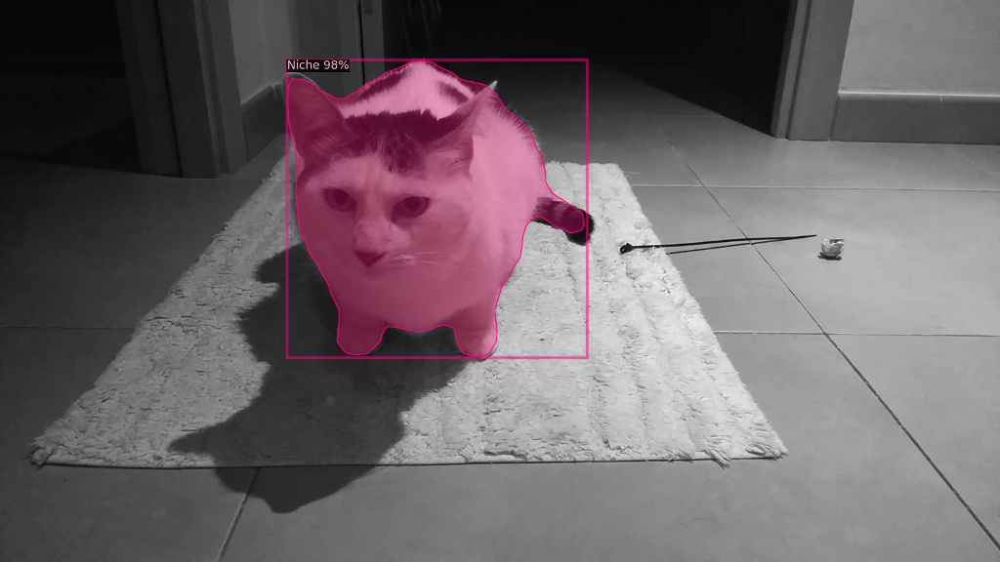
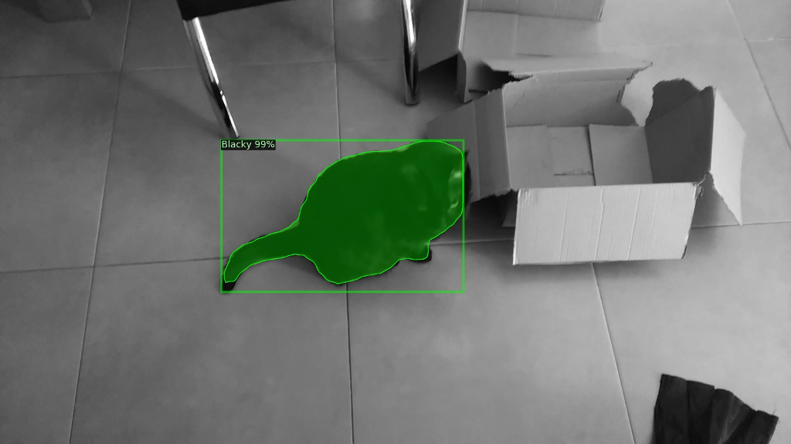
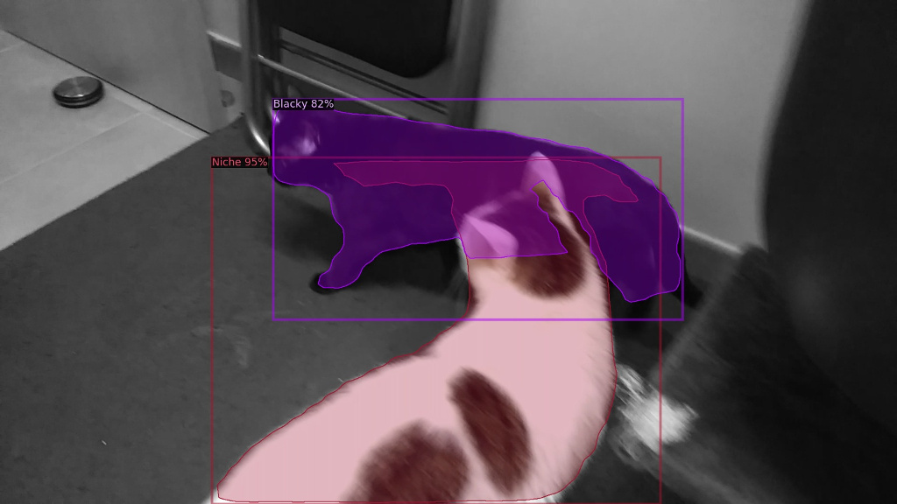

# Instance segmentation with Detectron 2

Applying segmentation to a custom dataset with two classes:

## Dataset

[README](./data/README.md) on <em>data</em> folder.

## References
[Detectron 2](https://github.com/facebookresearch/detectron2)

[Ballon detection](https://github.com/davamix/balloon-detectron2)
